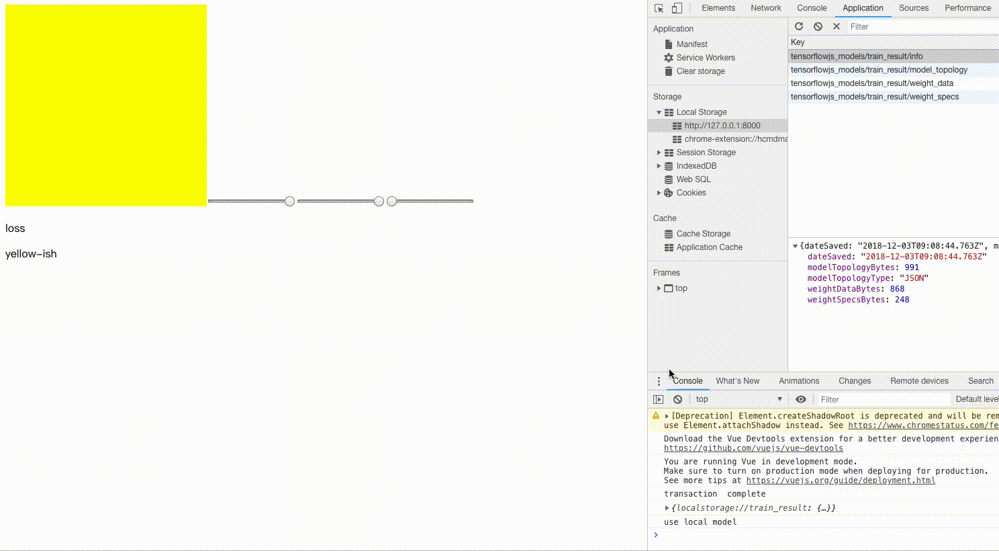

# `color_detect`

## Usage

```
>> npm i
>> caddy
>> cd data
>> node index.js
```
Then open 
[http://localhost:8000/clean.html](http://localhost:8000/clean.html) to clean Data (click not correct square to remove noise data)

[http://localhost:8000/train.html](http://localhost:8000/train.html) to train and use


## Description

This is a demo learn from [Youtube](https://www.youtube.com/watch?v=y59-frfKR58)

Use tensorflowjs to predict color reasut label

input: [[r,g,b]]   
output: 'red_ish'


